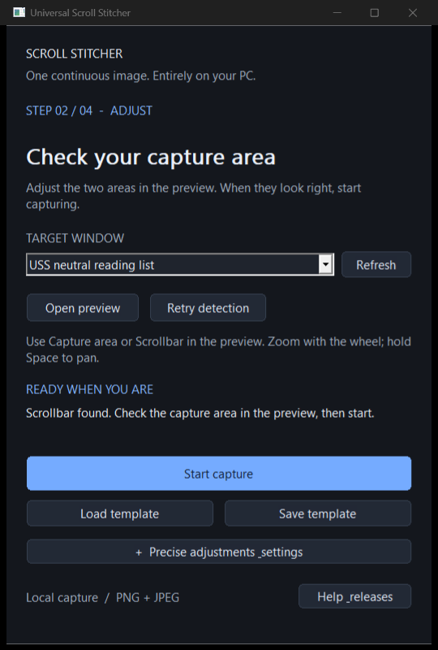
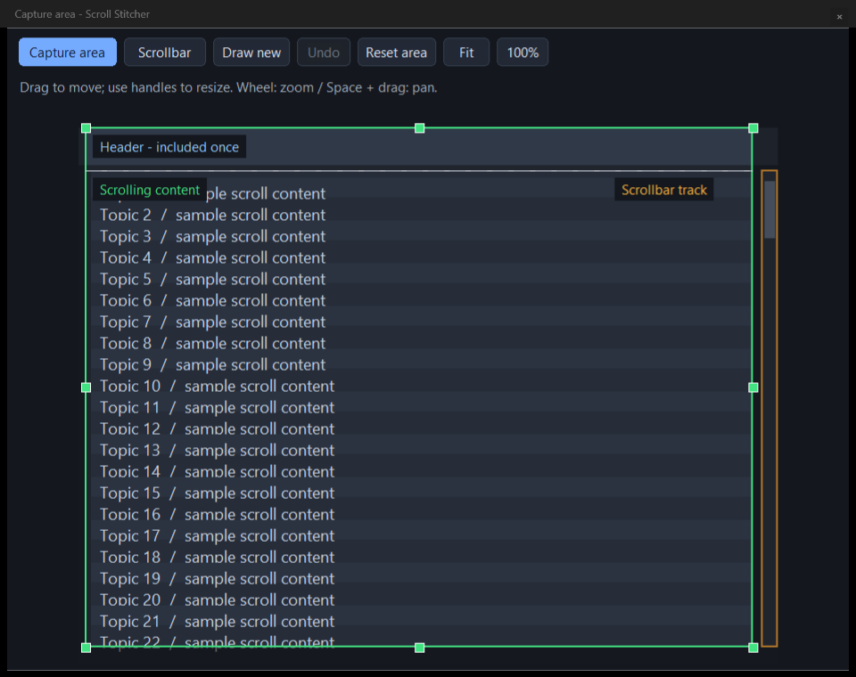

# Universal Scroll Stitcher

Turn a manually scrolled Windows app into one continuous image.

**[Download for Windows](https://github.com/Shaderx/UniversalScrollStitcher/releases/latest)** · Windows 10 / 11, x64 · Portable · PNG + JPEG

Extract the ZIP and open `UniversalScrollStitcher.exe`. No installer or separate runtime is needed. Capture stays on your PC; the app observes frames and never scrolls or sends input for you.

<p>
  
  
</p>

*Actual app screenshots using an illustrative capture target.*

## Capture in four steps

1. **Choose a window.** Its preview opens and finds the best scrollbar automatically.
2. **Check the capture area.** Adjust it in the separate preview if needed. The header above the scrollbar track is included once.
3. **Start capture.** Switch to your target and scroll down. Keep the target window the same size.
4. **Stop capture → Export image.** PNG is the default for sharp text; choose JPEG in the save dialog if preferred.

You can start partway down a page. Scroll to the top first when you want the whole page.

## Make the selection yours

Expand the detached preview for more room. Select **Capture area** or **Scrollbar** before editing; only that area responds.

- Drag inside the area to move it, or drag a handle to resize it.
- Use **Draw new** to replace an area with a fresh rectangle.
- For a scrollbar, select its **full travel track**, not just the moving thumb. Use the detected-scrollbar chooser when another match is better.
- Changing scrollbars preserves a capture area you have adjusted manually. Reset it explicitly when you want an automatically suggested area again.

| Control | Action |
| --- | --- |
| Mouse wheel | Zoom around the pointer |
| Space + drag | Pan the preview |
| Fit | Show the entire target |
| 100% | View original capture pixels |
| Escape | Cancel the current adjustment |
| Undo / Ctrl+Z | Restore the previous adjustment |

The preview holds still while you adjust a selection, then resumes updating. Closing the preview only hides it; **Open preview** brings it back.

**Reusable setups:** load or save a `.ussconfig` template from the control window. Templates preserve both areas and scale to the target's dimensions. Expand **Precise adjustments & settings** for coordinates, capture tolerance, and diagnostic logging.

## If capture needs help

- **Recovering:** scroll up slightly to restore overlap, then continue downward.
- **Paused:** finish and export the valid content captured so far.
- **Wrong scrollbar:** choose another detected track or draw it manually in the preview.
- **No preview:** make the target visible, then retry. Protected content and some hardware overlays cannot be captured.
- **Target resized:** retry the preview and check both areas before another capture.

Capture supports one vertical scrolling region at a time. Animation, horizontal scrolling, zooming the target, or highly repetitive content can make matching unreliable. Very tall JPEGs are split into numbered parts; PNG is preferred for long text captures.

<details>
<summary>Diagnostics</summary>

Enable **Diagnostic logging** under settings, then use **Open logs**. Logs are off by default and contain capture metadata and status, never screenshot pixels. They are saved under `%LOCALAPPDATA%\UniversalScrollStitcher\logs`, with a temporary-directory fallback. Logs roll over near 2 MiB and retain the newest 10 files.

</details>

<details>
<summary>Build and test</summary>

Requires Visual Studio 2022 with Desktop development with C++, a Windows SDK, CMake 3.24+, and vcpkg. Dependencies are declared in `vcpkg.json`.

```powershell
cmake -S . -B build-portable -A x64 `
  -DCMAKE_TOOLCHAIN_FILE=C:/vcpkg/scripts/buildsystems/vcpkg.cmake `
  -DVCPKG_TARGET_TRIPLET=x64-windows-static `
  -DCMAKE_MSVC_RUNTIME_LIBRARY=MultiThreaded
cmake --build build-portable --config Release
ctest --test-dir build-portable -C Release --output-on-failure
cmake --install build-portable --config Release --prefix release-candidate
```

C++/WinRT enables Windows Graphics Capture. Without it, capture falls back to visible-window GDI. The stitching engine stores accepted strips on disk rather than growing a full-resolution image in memory.

GitHub Actions builds and tests pull requests. A push to `main` publishes a portable executable and its dependencies as a new `build-N` release. Version tags publish named releases. License notices are included in the portable package.

To regenerate the documentation screenshots from the real UI with deterministic sample content, set `USS_SCREENSHOT_DIR` to an output directory and run `stitch_ui_workflow_tests`.

</details>
